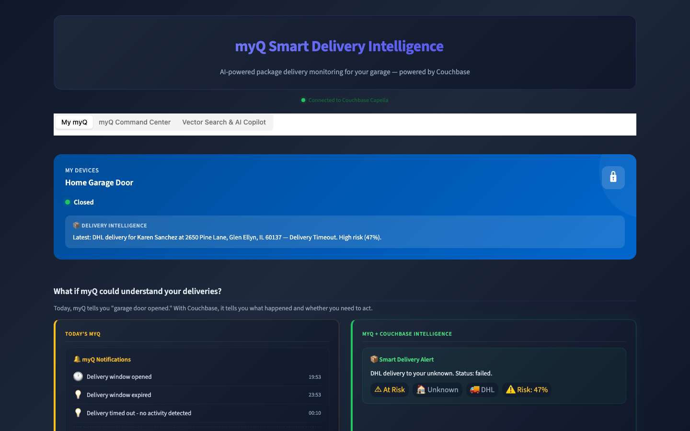
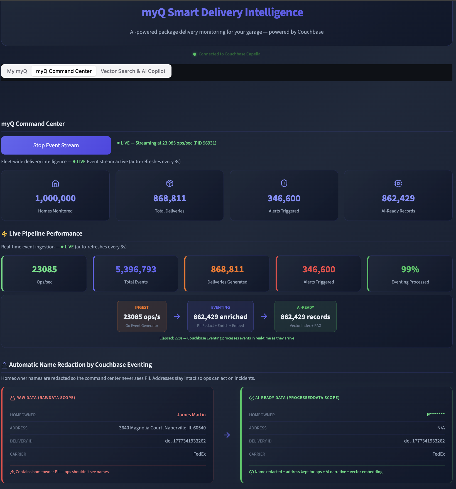
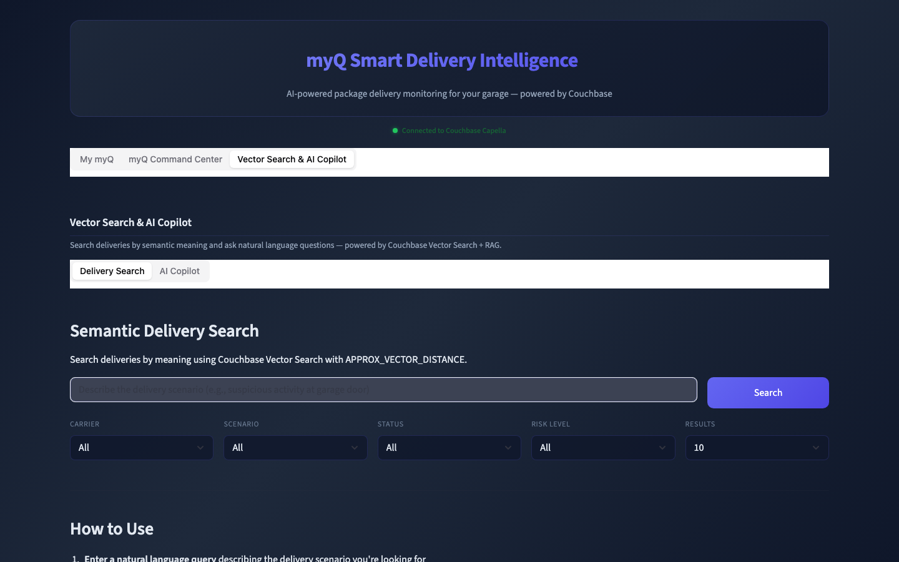

# myQ Smart Delivery Intelligence

**AI-powered package delivery monitoring for your garage -- powered by Couchbase**

A real-time IoT delivery event processing pipeline that demonstrates how Couchbase can power an end-to-end smart delivery platform with **zero middleware**. No Kafka, no Spark, no Lambda -- just Couchbase.

---

## What It Does

This demo simulates a fleet of 200+ smart garage homes processing package deliveries in real time. Events flow through Couchbase Eventing for automatic PII redaction, data enrichment, and vector embedding generation -- all serverless, all inside the database.

**Six delivery scenarios** run continuously:
- Happy path delivery
- Door stuck / mechanical failure
- Package behind car (obstruction)
- No package detected (false trigger)
- Delivery timeout
- Theft risk alert

---

## Screenshots

### My myQ -- Homeowner View
The consumer-facing dashboard shows real-time garage door status, active deliveries, and AI-powered notifications that explain what happened in plain English.



### myQ Command Center -- Fleet Operations
Live fleet monitoring with real-time stats across all 1 million homes. Watch deliveries, alerts, and AI-ready records climb at 50,000+ ops/sec. Includes live pipeline throughput metrics and automatic PII redaction powered by Couchbase Eventing.



### Vector Search & AI Copilot
Semantic delivery search using Couchbase Vector Search with `APPROX_VECTOR_DISTANCE`. Ask natural language questions about deliveries and get RAG-powered answers grounded in real event data.



---

## Architecture

```
Go Event Generator (3,000+ ops/sec)
        |
        v
  Couchbase Capella
  +-----------------------------------------+
  |  KV Store (sub-ms reads/writes)         |
  |       |                                 |
  |  Eventing Functions (serverless)        |
  |    - PII redaction (SSN, email, phone)  |
  |    - Risk scoring & geo-tagging         |
  |    - Scenario classification            |
  |    - Vector embedding generation        |
  |       |                                 |
  |  FTS + Vector Search Index              |
  |  N1QL Analytics                         |
  +-----------------------------------------+
        |
        v
  Streamlit Dashboard (3 tabs)
    - My myQ (homeowner view)
    - Command Center (fleet ops)
    - Vector Search & AI Copilot (RAG)
```

**Key: No middleware.** Couchbase Eventing replaces what would typically require Kafka + Spark + Lambda + a separate vector database.

---

## High-Throughput Event Generator

The Go-based event generator uses a **producer-consumer pattern** with the Couchbase `collection.Do()` bulk API:

- **40 parallel worker goroutines** consuming from a buffered channel
- **Batch writes of 100 documents** per bulk operation
- **Atomic counters** for real-time throughput metrics
- Result: **40k to 80,000+ ops/sec** sustained depending on network speed (570x faster than individual upserts)

```bash
cd event-generator
go build -o smart-delivery-gen .
./smart-delivery-gen --continuous --workers 40 --batch 100
```

---

## Couchbase Services Used

| Service | Purpose |
|---------|---------|
| **KV** | Sub-millisecond document reads/writes for delivery events |
| **Eventing** | Serverless PII redaction, data enrichment, vector embedding triggers |
| **FTS** | Full-text search across millions of delivery events |
| **Vector Search** | Semantic similarity search with `APPROX_VECTOR_DISTANCE` |
| **N1QL** | Ad-hoc SQL++ analytics and aggregations |

---

## Quick Start

### Prerequisites
- Python 3.11+
- Go 1.21+
- Couchbase Capella cluster (or self-managed 7.6+)
- OpenAI API key (for embeddings + RAG)

### Setup

```bash
# Clone
git clone https://github.com/abhijeetkb06/SmartDelivery.git
cd SmartDelivery

# Python environment
python3 -m venv .venv
source .venv/bin/activate
pip install -r requirements.txt

# Configure
cp .env.example .env
# Edit .env with your Couchbase and OpenAI credentials

# Run the dashboard
streamlit run app/main.py

# In another terminal -- start the event generator
cd event-generator
go build -o smart-delivery-gen .
./smart-delivery-gen --continuous --workers 40 --batch 100
```

### Couchbase Eventing Functions

Deploy the eventing functions from the `eventing/` directory:
- `delivery_knowledge_pipeline.js` -- PII redaction + data enrichment
- `vector_embedding_pipeline.js` -- Automatic OpenAI embedding generation

See [eventing/DEPLOY.md](eventing/DEPLOY.md) for deployment instructions.

---

## Project Structure

```
SmartDelivery/
  app/
    main.py                  # Streamlit entry point (3 tabs)
    tab_home.py              # My myQ -- homeowner dashboard
    tab_ops.py               # Command Center -- fleet operations
    tab_search_copilot.py    # Vector Search & AI Copilot
    couchbase_client.py      # Couchbase connection + queries
    charts.py                # Plotly chart components
    styles.py                # Dark theme CSS
    config.py                # Environment config
  event-generator/
    main.go                  # Producer-consumer bulk loader
    couchbase/client.go      # Couchbase Go SDK connection
    generator/               # Event, delivery, home generators
    models/                  # Go structs (event, delivery, alert, home)
    config/config.go         # CLI flags and config
  eventing/
    delivery_knowledge_pipeline.js   # PII redaction + enrichment
    vector_embedding_pipeline.js     # Vector embedding generation
  scripts/
    setup_couchbase.py       # Bucket/scope/collection setup
    simulate_eventing.py     # Local eventing simulation
```

---

## Built With

- [Couchbase Capella](https://cloud.couchbase.com) -- Cloud database platform
- [Couchbase Go SDK](https://docs.couchbase.com/go-sdk/current/hello-world/overview.html) -- High-throughput bulk operations
- [Streamlit](https://streamlit.io) -- Python dashboard framework
- [OpenAI](https://openai.com) -- Embeddings + chat completions for RAG
